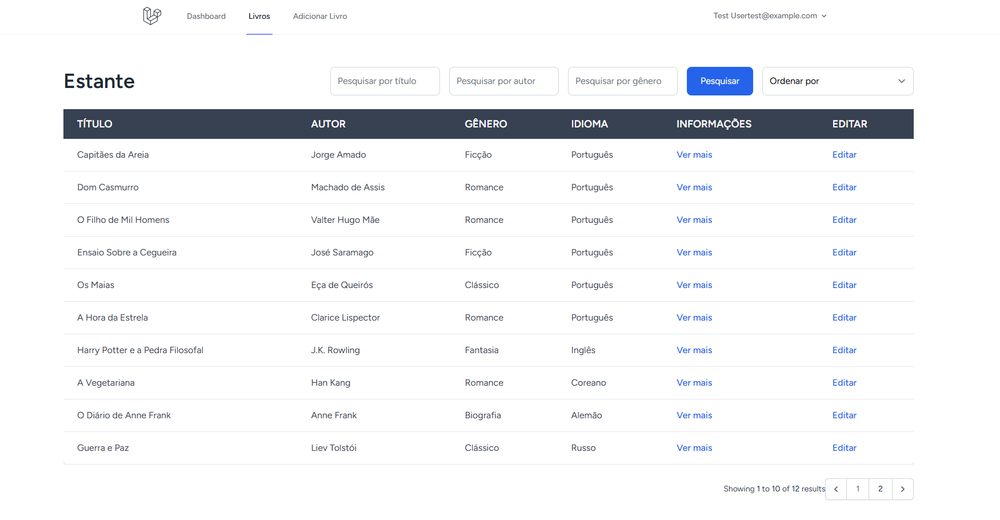

# Projeto PHP
Aplicação web para a gestão e consulta de livros de uma biblioteca
 
- Página principal
 É possível verificar a lista com os livros, com paginação, é possível pesquisar por nome do autor, título ou gênero do livro, e também é possível ordenar ordem alfabética ou ano de publicação.

- Na lista também é possível ver mais informações sobre o livro desejado, como a capa do livro, e é possível remover o livro. 

- Pode também adicionar um livro na biblioteca, e tem a opção de selecionar um autor que já esta na base de dados ou adicionar um autor novo. Só contas com role Admin podem adicionar livros.
  

- Também é possível alterar as informações sobre um livro que já existe. Só contas com role Admin podem adicionar livros.
    
