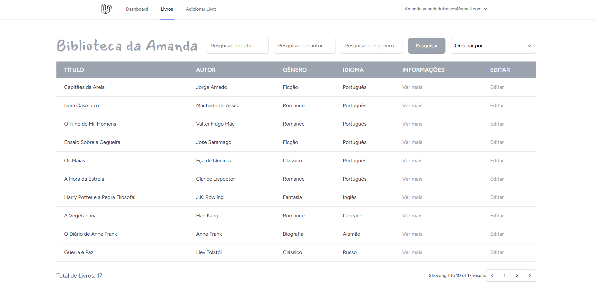
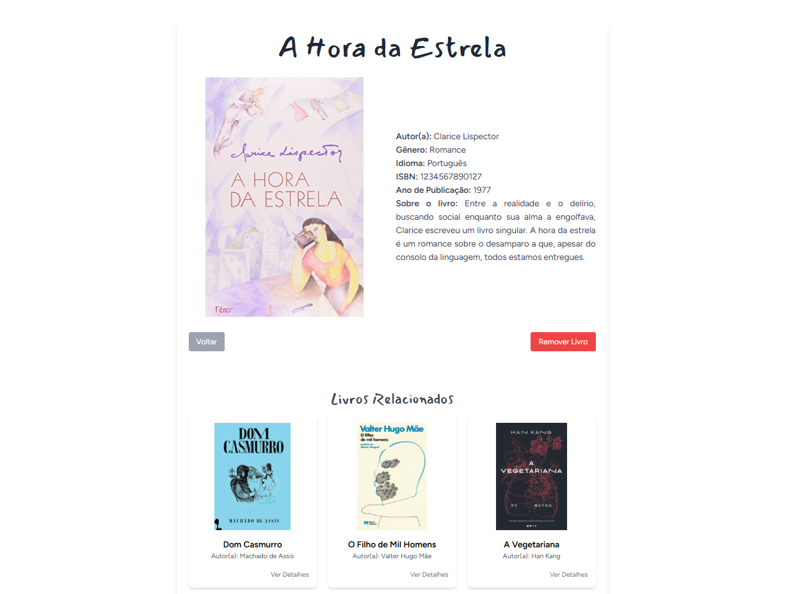
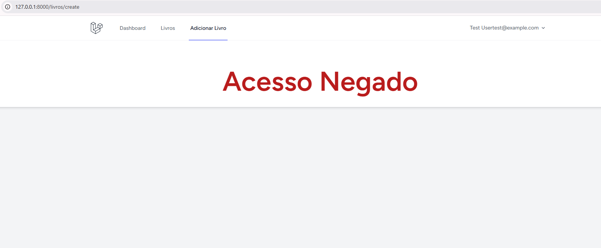

# Projeto PHP
Aplicação web para a gestão e consulta de livros de uma biblioteca

Como visualizar a aplicação localmente:
1. Requisitos
- PHP
- Composer
- Node.js
- MySQL
- XAMPP

2. Configurações da aplicação:
- Clone o Repositório
- Instale o composer com o comando: composer install
- Instale o Tailwind com o comando: npm install  npm run build
- Inicie o servidor com o comando: php artisan serve
- Acesse: http://127.0.0.1:8000/livros

3. Login na aplicação:
- Todos os usuários são criados com o role de user
- Pode alterar o role para admin no php myadmin

Página principal
- É possível verificar a lista com os livros, com paginação, é possível pesquisar por nome do autor, título ou gênero do livro, e também é possível ordenar ordem alfabética ou ano de publicação;

- Na lista também é possível ver mais informações sobre o livro desejado, a capa do livro, ver os livros relacionados (por gênero) e é possível remover o livro; 

- Porém só administradores podem remover um livro. Se for apenas user, o botão não irá aparecer;

- Pode também adicionar um livro na biblioteca, e tem a opção de selecionar um autor que já esta na base de dados ou adicionar um autor novo. Só contas com role Admin podem adicionar livros;
  

- Também é possível alterar as informações sobre um livro que já existe. Só contas com role Admin podem adicionar livros;
  

- Se o usuário tiver apenas o role de user, ao clicar em adicionar livro ou em editar, dará acesso negado
  
  
