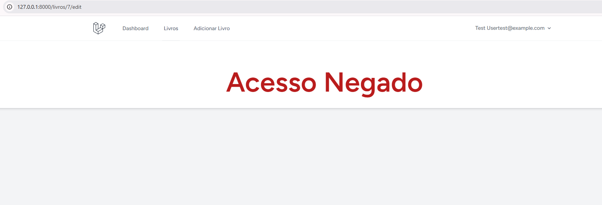

# Projeto PHP
Aplicação web para a gestão e consulta de livros de uma biblioteca

- Acesse: http://127.0.0.1:8000/livros
 
- Página principal
 É possível verificar a lista com os livros, com paginação, é possível pesquisar por nome do autor, título ou gênero do livro, e também é possível ordenar ordem alfabética ou ano de publicação;

- Na lista também é possível ver mais informações sobre o livro desejado, como a capa do livro, e é possível remover o livro; 

- Porém só administradores podem remover um livro. Se for apenas user, o botão não irá aparecer;

- Pode também adicionar um livro na biblioteca, e tem a opção de selecionar um autor que já esta na base de dados ou adicionar um autor novo. Só contas com role Admin podem adicionar livros;
  

- Também é possível alterar as informações sobre um livro que já existe. Só contas com role Admin podem adicionar livros;
  

- Se o usuário tiver apenas o role de user, ao clicar em adicionar livro ou em editar, dará acesso negado
  
  
